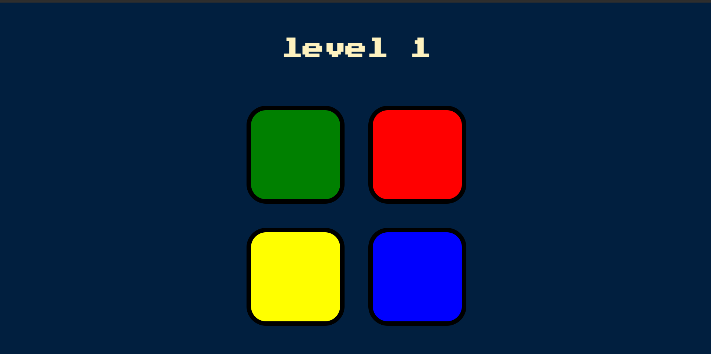

# Simon Game

This is a web-based implementation of the classic electronic memory game, Simon. The game tests your memory by challenging you to repeat a sequence of colors and sounds.


## How to Play

1.  **Start the Game:** Press any key to start the game.
2.  **Watch the Sequence:** The game will show you a sequence of colors by flashing the buttons and playing a corresponding sound.
3.  **Repeat the Sequence:** Click the buttons in the same order as the sequence you just saw.
4.  **Level Up:** If you repeat the sequence correctly, the game will add another color to the sequence and you will advance to the next level.
5.  **Game Over:** If you make a mistake, the game will end and you will have to start over.

## Features

*   Increasingly difficult levels
*   Sound and visual feedback for each button press
*   Game over screen with an option to restart
*   Responsive design that works on different screen sizes

## Technologies Used

*   HTML
*   CSS
*   JavaScript

## File Structure

```
├───game.js         // The main game logic
├───index.html      // The main HTML file
├───styles.css      // The stylesheet for the game
└───sounds          // Folder containing the sound files for the game
    ├───blue.mp3
    ├───green.mp3
    ├───red.mp3
    ├───wrong.mp3
    └───yellow.mp3
```

## Credits

This project was created as part of the [Angela Yu Web Development Bootcamp](https://www.udemy.com/course/the-complete-web-development-bootcamp/).
